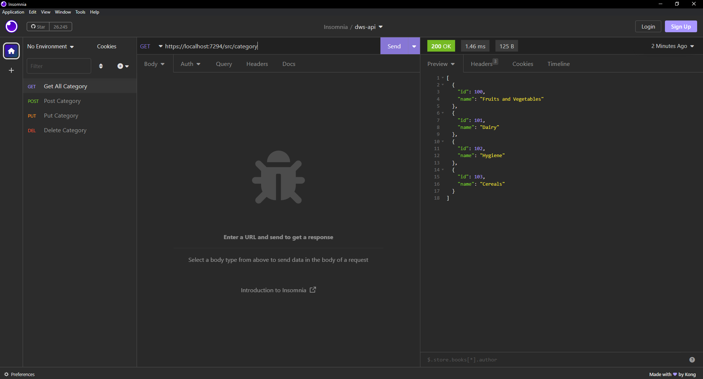
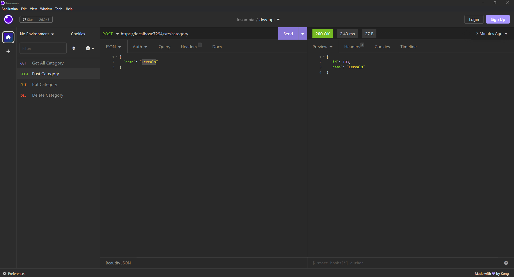
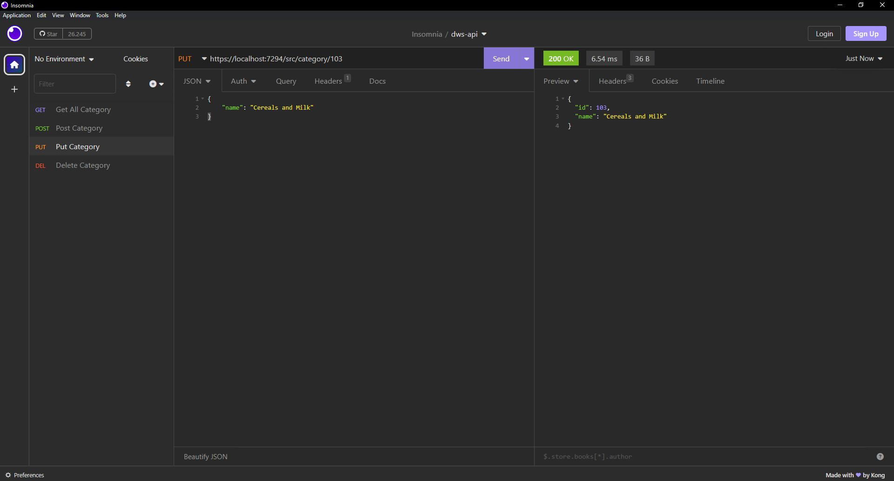
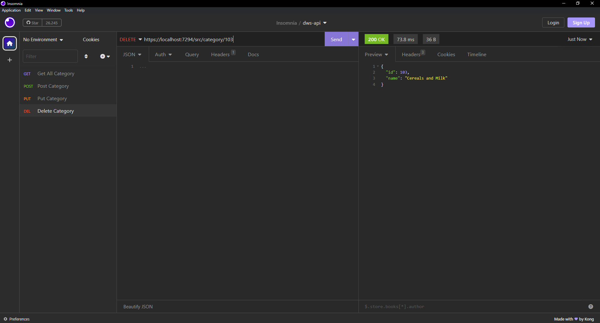
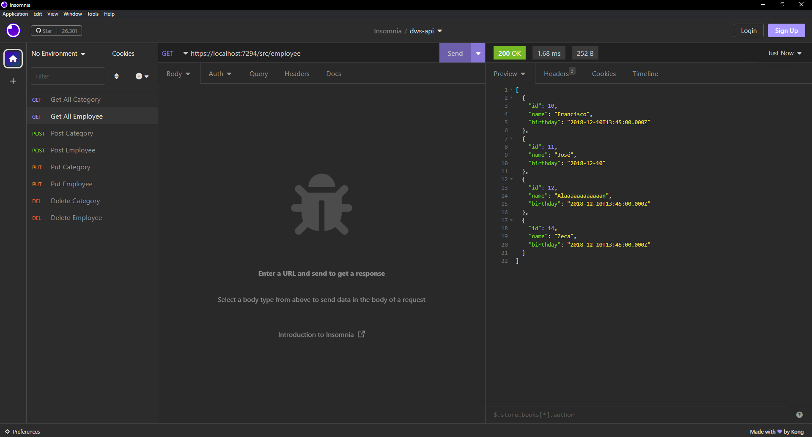
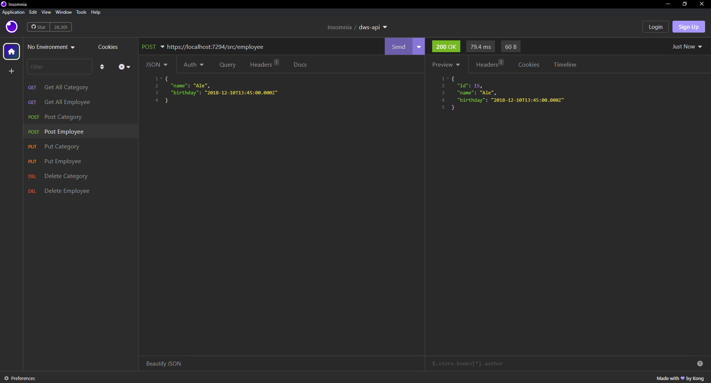
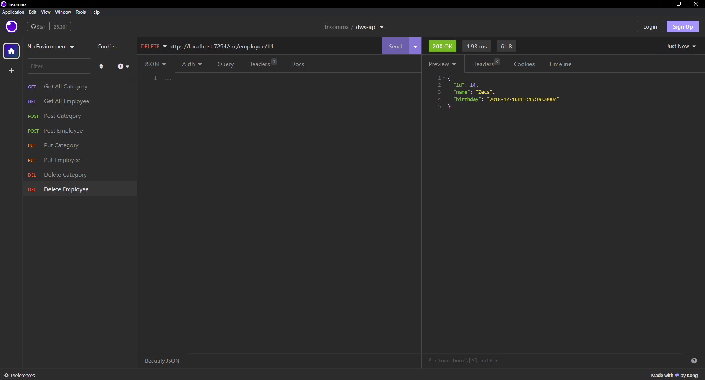

<h1 align="center">CURSO DESENVOLVIMENTO DE WEB SERVICES COM .NET</h1>
<h2 align="center">DESAFIO 1</h2>

### GET Category

### POST Category

### PUT Category

### DELETE Category

### GET Employee

### POST Employee

### PUT Employee

### DELETE Employee

